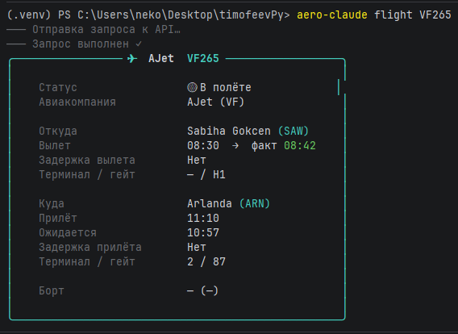
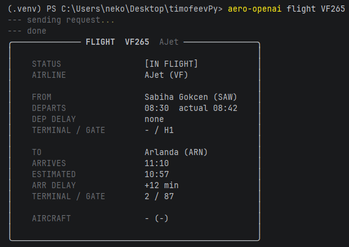
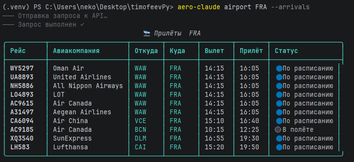
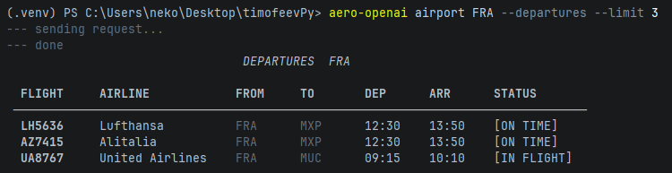
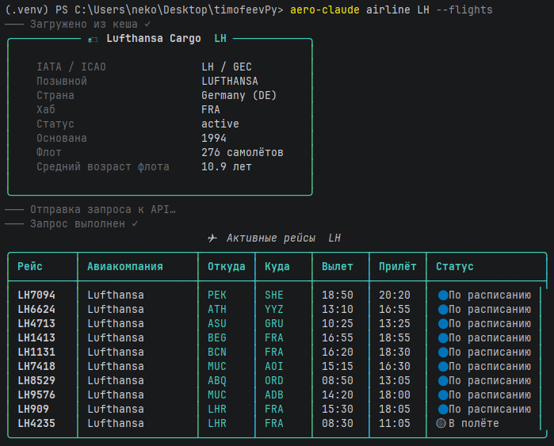
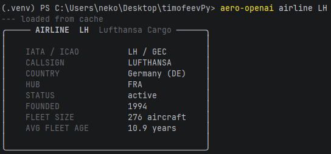
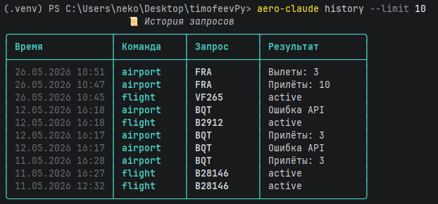
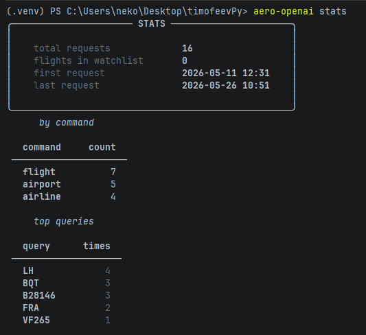
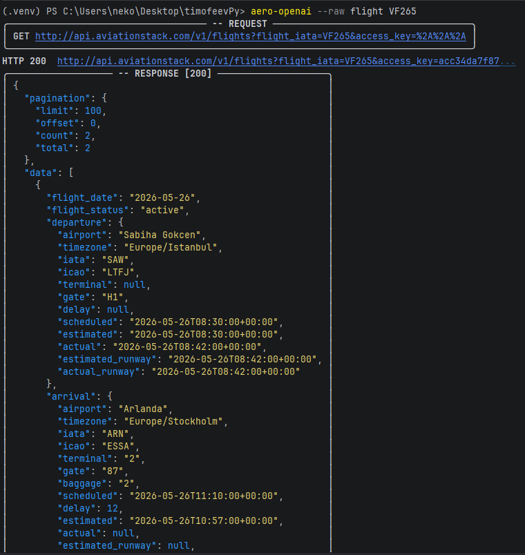

# Отчет по проекту AeroTrack CLI

## Описание проекта

Проект `timofeevPy` представляет собой терминальный авиационный помощник AeroTrack CLI. Приложение позволяет получать информацию о рейсах, аэропортах и авиакомпаниях через AviationStack API, а также вести локальную историю запросов и список отслеживаемых рейсов.

В репозитории реализованы две версии одного CLI-приложения:

- `claude` - версия, сгенерированная/проработанная с использованием Claude.
- `openai_edition` - версия, сгенерированная/проработанная с использованием OpenAI.

Обе версии имеют похожую архитектуру:

- `main.py` - точка входа и регистрация CLI-команд.
- `api/aviationstack.py` - клиент для работы с AviationStack API.
- `commands/` - обработчики команд `flight`, `airport`, `airline`, `watch`, `history`, `stats`.
- `db/database.py` - локальное хранение данных в SQLite.
- `utils/` - форматирование и вывод данных в терминал.
- `data/*.db` - локальные базы данных для истории, watchlist и кэша авиакомпаний.

Команды запуска объявлены в `pyproject.toml`:

```bash
aero-claude
aero-openai
```

Основная функциональность:

- получение статуса рейса по номеру;
- просмотр прилетов и вылетов по IATA-коду аэропорта;
- получение информации об авиакомпании и ее активных рейсах;
- добавление рейсов в локальный watchlist;
- просмотр и очистка истории запросов;
- просмотр статистики использования;
- режим `--raw` для вывода полного HTTP-запроса и ответа API.

## Выбранные ИИ для сравнения

Для сравнения были выбраны две ИИ-системы:

| ИИ | Реализация в проекте | CLI-команда | Характер версии |
|---|---|---|---|
| Claude | `claude/` | `aero-claude` | Более ориентирована на русскоязычный UX, содержит отдельную команду `help` |
| OpenAI | `openai_edition/` | `aero-openai` | Более минималистичная и технически аккуратная версия, лучше реализован глобальный режим `--raw` |

Обе реализации решают одну и ту же задачу и используют одинаковый стек: Python, Click, Rich, Requests, python-dotenv, SQLite и pytest.

## Методология сравнения и критерии

Сравнение выполнялось по исходному коду, структуре проекта, документации `README.md`, результатам анализа из `docs/RESULT.md` и набору тестов для `openai_edition`.

Критерии сравнения:

| Критерий | Что оценивалось |
|---|---|
| Понимание задачи | Насколько полно реализованы сценарии авиационного CLI |
| Архитектура | Разделение на API, команды, БД и форматирование |
| Качество кода | Читаемость, единообразие, отсутствие явных ошибок |
| UX CLI | Удобство команд, подсказки, язык интерфейса, читаемость вывода |
| Работа с API | Корректность запросов, обработка ошибок, поддержка ограничений free-плана |
| Локальное хранение | История, watchlist, кэш авиакомпаний |
| Тестируемость | Наличие и полнота автоматических тестов |
| Производительность | Количество сетевых запросов, использование кэша, отсутствие лишних операций |
| Документированность | README, help-команды, комментарии и docstring |

Итог по сравнительному анализу:

| Критерий | `claude` | `openai_edition` | Вывод |
|---|---:|---:|---|
| Понимание задачи | 8/10 | 8/10 | Паритет по основной функциональности |
| Качество кода | 7/10 | 8/10 | У `openai_edition` аккуратнее реализован `--raw` |
| UX CLI | 9/10 | 7/10 | `claude` удобнее для русскоязычного пользователя |
| Обработка ошибок | 7/10 | 7/10 | В обеих версиях есть базовая обработка API-ошибок |
| Документированность | 8/10 | 7/10 | У `claude` есть отдельная команда `help` |
| Производительность | 6/10 | 6/10 | В обеих версиях есть риск лишних запросов при работе с кэшем |

Вывод: для демонстрационного MVP удобнее версия `claude`, потому что она лучше оформлена для пользователя. Для дальнейшего технического развития предпочтительнее брать за основу `openai_edition`, так как она более консистентна по реализации режима `--raw` и уже покрыта тестами.

## Использование утилит

В проекте использованы следующие библиотеки и утилиты:

| Утилита/библиотека | Назначение |
|---|---|
| `click` | Создание CLI-команд и параметров |
| `rich` | Красивый вывод таблиц, панелей и сообщений в терминале |
| `requests` | HTTP-запросы к AviationStack API |
| `python-dotenv` | Загрузка переменных окружения из `.env` |
| `sqlite3` | Локальное хранение истории, watchlist и кэша |
| `pytest` | Автоматическое тестирование |
| `click.testing.CliRunner` | Тестирование CLI-команд без запуска внешнего процесса |

Для работы приложения используется переменная окружения:

```bash
AVIATION_API_KEY=<ключ AviationStack>
```

Для локального запуска без установки пакета можно использовать Python-модули напрямую, а после установки проекта доступны команды `aero-claude` и `aero-openai`.

Примеры команд из `README.md`:

```bash
aero-claude flight LH438
aero-claude airport FRA --arrivals
aero-claude airport FRA --departures --limit 5
aero-claude airline LH --flights
aero-claude watch add LH438
aero-claude history
aero-claude stats
aero-claude --raw flight LH438
```

Для версии OpenAI используются аналогичные команды с префиксом `aero-openai`.

## Описание API

Проект работает с AviationStack API. Основной клиент расположен в:

- `claude/api/aviationstack.py`
- `openai_edition/api/aviationstack.py`

Базовый адрес API в коде:

```text
http://api.aviationstack.com/v1
```

Используемые endpoint'ы:

| Endpoint | Назначение | Использование в проекте |
|---|---|---|
| `/flights` | Получение данных о рейсах | Статус рейса, прилеты, вылеты, рейсы авиакомпании |
| `/airports` | Получение информации об аэропортах | Карточка аэропорта по IATA-коду |
| `/airlines` | Получение информации об авиакомпаниях | Карточка авиакомпании и заполнение локального кэша |

Основные методы клиента:

| Метод | Описание |
|---|---|
| `get_flight(flight_iata)` | Получает статус конкретного рейса |
| `get_flights_by_airline(airline_iata, limit)` | Получает активные рейсы авиакомпании |
| `get_airport(iata_code)` | Получает данные аэропорта |
| `get_arrivals(airport_iata, limit)` | Получает список прилетов в аэропорт |
| `get_departures(airport_iata, limit)` | Получает список вылетов из аэропорта |
| `get_airline(iata_code)` | Получает данные авиакомпании, сначала проверяя локальный кэш |

Клиент добавляет API-ключ в параметр `access_key`, выполняет GET-запрос и обрабатывает типовые ошибки:

- отсутствие интернет-соединения;
- timeout;
- HTTP 403 для недоступных endpoint'ов free-плана;
- HTTP 429 при превышении лимита;
- ошибки, которые AviationStack возвращает внутри JSON при HTTP 200.

Режим `--raw` выводит полный HTTP-запрос и JSON-ответ. В `openai_edition` этот режим реализован через глобальный флаг `RAW_MODE`, который учитывается при создании `AviationStackClient`.

## Локальная база данных

Для локального хранения используется SQLite. В базе создаются таблицы:

| Таблица | Назначение |
|---|---|
| `watchlist` | Список рейсов, добавленных пользователем для отслеживания |
| `history` | История выполненных CLI-запросов |
| `airline_cache` | Кэш данных об авиакомпаниях для экономии API-квоты |

Это позволяет выполнять часть команд локально, не расходуя лимит AviationStack API.

## Тестирование

В `openai_edition/tests` подготовлен набор pytest-тестов:

- `test_formatter.py` - проверка форматирования дат, времени, задержек и данных рейса;
- `test_database.py` - проверка SQLite-операций;
- `test_aviationstack_unit.py` - проверка API-клиента через моки без реальных сетевых запросов;
- `test_cli.py` - проверка CLI-команд через `CliRunner`;
- `test_aviationstack_live.py` - ограниченные live smoke-тесты для AviationStack.

Локальные тесты не должны расходовать API-квоту. Live-тесты помечены маркером `live_api` и должны запускаться отдельно только при наличии ключа и явного разрешения.

Команды запуска:

```bash
pytest -m "not live_api"
RUN_LIVE_AVIATIONSTACK=1 pytest -m live_api -q
```

## Основные результаты проекта

В ходе работы был получен сравнительный анализ двух AI-сгенерированных реализаций одного CLI-приложения. Обе версии реализуют общий набор команд и используют одинаковую архитектурную схему.

Сильные стороны проекта:

- понятная модульная структура;
- работающий CLI-интерфейс;
- интеграция с внешним API;
- локальная история запросов;
- watchlist для рейсов;
- кэширование авиакомпаний;
- отдельная тестовая база для `openai_edition`.

Выявленные ограничения:

- высокая степень дублирования между `claude` и `openai_edition`;
- базовый URL API использует `http`, желательно заменить на `https`;
- при отсутствии `AVIATION_API_KEY` возможны необработанные ошибки в отдельных сценариях;
- endpoint'ы `/airports` и `/airlines` могут быть недоступны на free-плане AviationStack;
- часть функциональности зависит от внешнего API и месячной квоты.

## Скриншоты работы

### flight запросы






### airport запросы






### airline запросы





### Дополнительные команды
История запросов и команд


Статистика запросов


Запрос с параметром --raw для вывода больше информации о запросе и ответе

